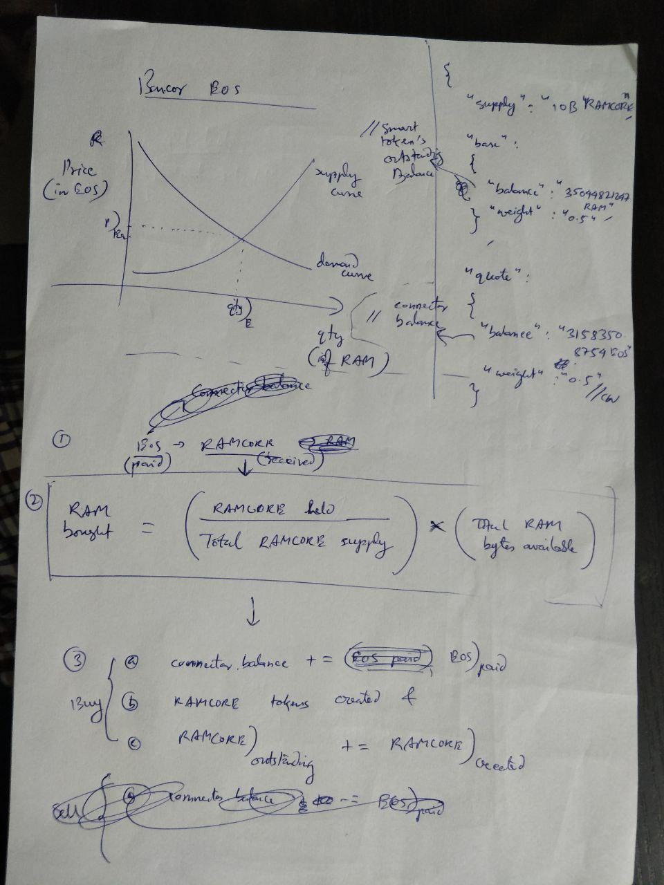
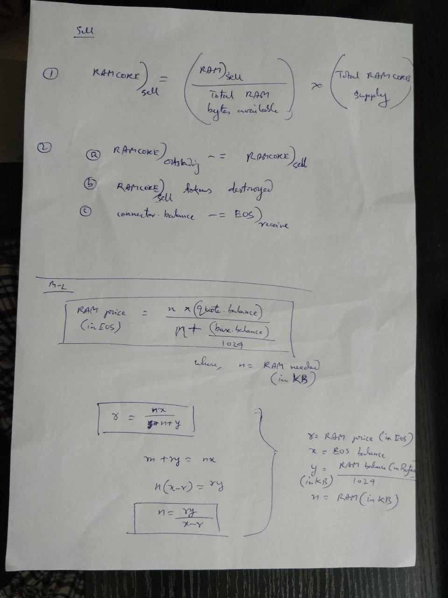

## EOS Bancor Algorithm
* RAM is required to store account info.:
	- keys
	- balances
	- contract state
* Dan Larimer and the Block.One team realized that a more incentivized cryptoeconomics-driven ecosystem needed to be created which will ensure RAM availability. Read the [The RAM Quandary](https://blog.springrole.com/the-mechanics-behind-eosio-ram-allocation-940204bc5b7e): Know the history in EOS Dawn 3.0.
* Each time someone buys or sells RAM, a 0.5% fee is applied on both the buyer’s side and the seller’s side (1% overall).
* This actually gives an economic incentive for users to sell their RAM and also it discourages speculative marketing and inflation as the fees that are collection are promptly burned (removed from the ecosystem).
* Notes on Buy/Sell ram EOSIO functions [Source](https://blog.springrole.com/the-mechanics-behind-eosio-ram-allocation-940204bc5b7e)
* when you sell ram back to the system contract, you receive an amount of liquid EOS proportionate to the current spot price of ram. if spot ram price is high, your receive more EOS in return. if spot ram price is low, you receive less EOS in return. the spot price is determined by something called the bancor algorithm.
* after selling the RAM, you're EOS is liquid and thus available to do whatever you want with it
* if you sell all your ram, you might not be able to do anything with that account anymore (there's a minimum amount of ram needed to function). but no, there's nothing really stopping you from doing whatever you want with your EOS after your sell RAM. its not like delegation where you have to wait 3 days.
* `RAMCORE` is a smart token that connects the two reserves EOS and RAM. The two-step conversion `EOS<->RAMCORE<->RAM` can be combined into one by composing the corresponding equations into one equation for EOS<->RAM. There is no particular reason not to do the one-step calculation. Moving forward, that's what we use. REX is an example. [Source](https://github.com/EOSIO/eos/issues/6554)
* When you buy RAM, you’re buying from the contract. When you sell RAM, you sell to the contract. You pay EOS and get RAMCORE tokens which entitles you to store as much RAM as your RAMCORE tokens allow:
```
( ( RAMCORE held / Total RAMCORE supply ) * Total RAM bytes available )
```

* Speculators are further discouraged because at any point more RAM could be added by block producers (who actually supply the RAM) essentially flooding the market with supply and crashing the price.
* All the RAM fees is further transferred to REX.
* Formula for `buyrambytes` ACTION. When user wants to buy RAM (in KB), then the RAM price:
```
RAM price (in EOS) = (n * quote.balance) / (n + base.balance / 1024)

where,
n = RAM needed (in KB)
```
* [My EOS RAM Calc](./eos_ram_calc.xlsx)
* Illustration of buying RAM:
<p align="left">
  
</p>

* Illustration of selling RAM & Formula (from RAM price to RAM amount & viceversa):
<p align="left">
  
</p>


## References
* [EOSIO RAM Market & Bancor Algorithm by Daniel Larimer](https://medium.com/@bytemaster/eosio-ram-market-bancor-algorithm-b8e8d4e20c73)
* [Bancor whitepaper](https://storage.googleapis.com/website-bancor/2018/04/01ba8253-bancor_protocol_whitepaper_en.pdf)
* [Calculate EOS RAM price using Bancor protocol](https://steemit.com/eosram/@noomsteem/calculate-eos-ram-price-using-bancor-protocol)
* [What is the Bancor algorithm and how it is used for RAM trading?](https://eosio.stackexchange.com/q/1317/167)
* [“[Beyond The White Paper (Vol.4)] Bancor Algorithm: Mathematical & Economic Analysis” by Huobi Research ](https://link.medium.com/g7Wsm41Xq8)
* [Reddit: EOS RAM price calculation Bancor protocol](https://www.reddit.com/r/eos/comments/8wsdrz/eos_ram_price_calculation_bancor_protocol/)
* [YouTube: How Much Would It REALLY Cost To Run CryptoKitties on EOS?](https://www.youtube.com/watch?v=EBC9MBybsCI)
* [Bancor Help Center: What is RAM, CPU and NET on EOS](https://support.bancor.network/hc/en-us/articles/360018325291-What-is-RAM-CPU-and-NET-on-EOS)
* [The Mechanics Behind EOSIO RAM Allocation](https://blog.springrole.com/the-mechanics-behind-eosio-ram-allocation-940204bc5b7e)
* [How we Calculate EOS Resource Usage](https://medium.com/shyft-network-media/eos-resource-usage-f0a8098827d7)
* [How to Find Ram Market Bancor Connector Weight (CRR)](https://eosio.stackexchange.com/questions/1324/how-to-find-ram-market-bancor-connector-weight-crr)
* Code Help
	- [exchange_state.hpp](https://github.com/abhi3700/eosio-playground/blob/master/libs/contracts/eosio.system/include/eosio.system/exchange_state.hpp)
	- [exchange_state.cpp](https://github.com/abhi3700/eosio-playground/blob/master/libs/contracts/eosio.system/src/exchange_state.cpp)
	- [buyram, sellram functions declared](https://github.com/abhi3700/eosio-playground/blob/master/libs/contracts/eosio.system/include/eosio.system/eosio.system.hpp)
	- [buyram, sellram functions defined](https://github.com/abhi3700/eosio-playground/blob/master/libs/contracts/eosio.system/src/eosio.system/eosio.system.cpp)